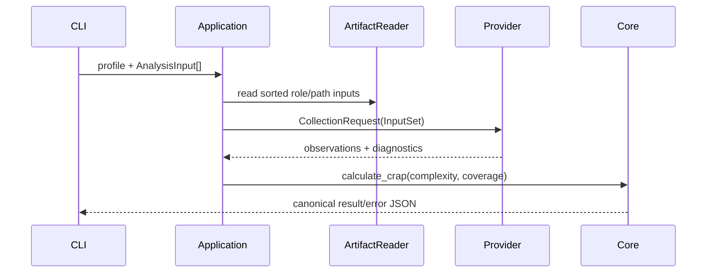
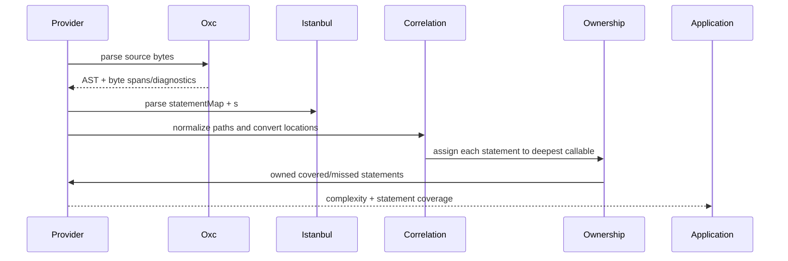

# Design: JVM JaCoCo Rename and TypeScript Oxc/Istanbul Provider

## Technical Approach

Flow is `CLI -> application (one Artifact) -> provider -> core CRAP`. The target preserves `model -> core -> application -> provider -> CLI`, replaces the positional artifact with a validated role collection, and adds one provider. Providers emit measurements; `codegauge-core::calculate_crap` remains the sole CRAP implementation.

## Architecture Decisions

| Choice | Rejected | Rationale |
|---|---|---|
| Typed `InputRole` contains only `Coverage` and `Source`; source repeats are supported. | Six speculative roles or provider-specific flags | These are the roles needed now; future roles extend the container, not `MetricProvider`. |
| Keep `codegauge-result/v1`; add optional role-tagged `provenance.inputs`, retaining legacy `input` as primary coverage. | Replacing `input` or inventing a schema for additive provenance | Consumers read the primary artifact and results record all digests. Error v1 is unchanged. |
| Exact Oxc crates, syntactic traversal only. | `oxc_semantic`, Node/FFI, tree-sitter, external tools | McCabe needs syntax/spans, not symbol resolution. |

## Contracts and Data Flow

`codegauge-model` owns the public request type; `codegauge-application` owns resolved bytes:

```rust
enum InputRole { Coverage, Source } // wire: "coverage", "source"
struct AnalysisInput { role: InputRole, path: String }
struct InputSet { by_role: BTreeMap<InputRole, Vec<Artifact>> }
struct CollectionRequest<'a> { inputs: &'a InputSet }
enum InputCardinality { ExactlyOne, OneOrMore }
struct InputRequirement { role: InputRole, cardinality: InputCardinality }
struct ProfileDescriptor { profile, provider, semantics, required_inputs: Vec<InputRequirement> }
trait MetricProvider { fn descriptor(&self) -> ProfileDescriptor;
  fn collect(&self, request: CollectionRequest<'_>) -> Result<ProviderObservations, ProviderError>; }
```

`InputSet` rejects duplicate `(role, normalized path)`, undeclared roles, missing cardinalities, empty paths, and non-regular/unreadable/oversized artifacts. It orders roles and paths deterministically. JVM declares `coverage: ExactlyOne`; TypeScript declares `coverage: ExactlyOne, source: OneOrMore`.



`Analyzer` selects the descriptor, validates before I/O, reads inputs, invokes the provider, drops incomplete symbols, calls core, then sorts IDs and builds provenance.

## JVM Migration and Provenance

Rename `ProfileId::JavaJacocoV1`/constant/wire value to `JvmJacocoV1`/`jvm-jacoco-v1`; both old profile names are unsupported. JVM identity and JaCoCo semantics stay unchanged. Native Kover without `COMPLEXITY` is incompatible; `useJacoco()` output is JVM JaCoCo. Update docs, fixtures/goldens, and references; no alias without consumer evidence. Provenance writes `input=coverage` plus sorted `inputs=[coverage, source...]`; `ErrorDetails` names the deterministic failing path/digest.

## TypeScript Provider Boundaries

`codegauge-provider-typescript/{parser,callable,complexity,istanbul,correlation,ownership,diagnostics}.rs`: Oxc traversal produces callable `{path,name,span,body_span}` records and decision nodes; identities are `typescript:<normalized-path>#<name>@<start>-<end>` (`class_vm=path`, `descriptor=span`). Istanbul accepts only `statementMap` + `s`; raw V8, `f`, `fnMap`, and `b` hits are never used.

McCabe `typescript-oxc-mccabe-v1` starts at 1 and adds one for each `if`, ternary, `for`/`for-in`/`for-of`, `while`, `do`, non-default `case`, `catch`, `&&`, and `||`. `switch`, `else`, `default`, `??`, optional chaining, returns, and TypeScript-only nodes add zero. Nested callable bodies are skipped while counting the parent and counted independently.



Paths use `/` normalization only: no realpath, prefix inference, or autodetection. Coverage key and `FileCoverage.path` must agree; each coverage file matches exactly one source path. Locations are 1-based line/0-based column, converted via line starts to UTF-8 byte spans; invalid boundaries, duplicate spans, unmatched paths, or ambiguous ownership are fatal `INVALID_INPUT`. Statements outside callables and zero-owned callables are omitted with bounded diagnostics. Coverage is `covered statements (s>0) / owned statements`; function hits are irrelevant.

## CLI, Files, and Tests

Clap uses repeated `--input ROLE=PATH` (`ArgAction::Append`), `split_once('=')`, and generic role parsing. Syntax/format/unknown-role errors map to `CLI_ERROR`/2; missing files 3; malformed/uncorrelatable artifacts 5; unsupported profile 4; partial/no-compatible results 6; complete 0. Inputs are normalized before reading; stdout remains one newline-terminated JSON document and diagnostics go to stderr.

Modify `Cargo.toml`/lock, model/application/JVM/CLI/conformance crates, schemas, README, fixtures, and goldens; create the TypeScript crate/modules/tests. Strict TDD starts with failing contract, validation, CLI, Oxc, ownership, hostile-input, golden, and reordered-input tests. Run locked tests, fmt, Clippy, check, and Python.

Pin `oxc_allocator`, `oxc_parser`, `oxc_ast`, `oxc_ast_visit`, `oxc_span`, and `oxc_syntax` to `=0.147.0`; upstream manifests declare MSRV 1.96, compatible with Rust 1.97.1. Before implementation, verify published manifests and exact parser/visitor/function-field APIs against pinned docs/source and compile a minimal adapter; if they drift, block rather than bump the toolchain silently.

Discrete crates avoid full-feature build cost; exact pinning trades update work for reproducibility.

## Migration / Rollout

Pre-release rollback is a revert. After publication, recover with a corrective patch and, only with evidence, a deprecated old-profile alias; never alter CRAP or schema semantics silently. No downloads, installs, manifests, policy, LLM, or runtime commands are introduced.

## Open Questions

- [ ] Verify Istanbul’s current column unit with a checked-in non-ASCII fixture before finalizing byte conversion.
- [ ] Confirm Oxc `0.147.0` crates.io/API alignment under the locked Rust 1.97.1 toolchain.
